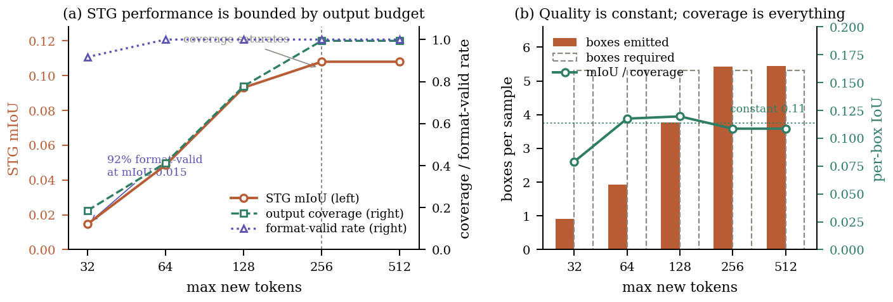

# SPIRAL

**Structured Supervision Harvesting and Self-Refining Inference for Heterogeneous Medical Video Understanding**

[](https://openreview.net/forum?id=Ude69Oicir)
[]()
[](https://www.python.org/)
[](LICENSE)
[](https://huggingface.co/datasets/UII-AI/MedVidBench)

Official implementation of **Team MINDH Lab** for the MedVidU Challenge at the ECCV 2026 Workshop on
Medical Video Understanding. Accepted as an **Oral**.

---

## What this repository is for

Two things, and the second matters more than the first.

**A working pipeline** for the MedVidU / MedVidBench benchmark, covering data
preparation, supervision harvesting, LoRA adaptation of Qwen3-VL, self-refining
inference, and a submission builder that enforces the leaderboard schema.

**Two measurements about the benchmark itself** that apply to anyone working on
it, independently of this pipeline.

### Finding 1 - reported grounding accuracy is bounded by output token budget

Spatiotemporal grounding references contain **5.31 boxes on average**, and one
box costs about 25 tokens once serialised. A generation budget that admits one
box scores near zero regardless of how good that box is.

| max tokens | STG mIoU | boxes emitted | coverage | **format-valid** |
|---|---|---|---|---|
| 32 | 0.0147 | 0.92 | 0.186 | **0.92** |
| 64 | 0.0486 | 1.92 | 0.413 | 1.00 |
| 128 | 0.0931 | 3.77 | 0.778 | 1.00 |
| 256 | **0.1080** | 5.42 | 0.994 | 1.00 |
| 512 | 0.1080 | 5.44 | 0.994 | 1.00 |

A **7.35×** swing from decoding configuration alone. Per-box IoU stays flat at
0.108 to 0.120 across the entire sweep, so the variation is coverage, not
localisation quality.

The critical column is the last one. **92% of predictions pass format validation
at the budget where the metric reads 0.0147**, because a truncated sequence is
still syntactically well formed. Standard output checking cannot detect this.

Skill assessment shows the same shape more sharply, 5.67× between 16 and 64
tokens. Temporal grounding, whose references hold only 1.76 spans, varies by 12%
across the same sweep. The effect is specific to sequence-valued references.



### Finding 2 - predictions must be keyed on the question, not the clip

The released identifier is `video_id&&start&&end&&fps`. It encodes clip
provenance, not question identity.

| key | distinct keys | rows merged |
|---|---|---|
| identifier | 3,975 | 2,270 |
| identifier + task | 5,644 | 601 |
| identifier + task + question hash | **6,216** | 29 |

On 6,245 test rows, keying by identifier alone collapses **36%** of the split. A
prediction store built that way serves one question the answer generated for
another, and the failure is silent. Adding a hash of the question text resolves
all but 29 byte-identical duplicates.

Measured effect of the correction on the hidden test set, regenerating only the
572 recoverable rows: STG 0.071 → **0.083**, TAG@0.3 0.199 → 0.200,
RC_llm 3.374 → 3.380.

---

## Method

.png)

| | Component | Stage | What it does |
|---|---|---|---|
| C1 | Structured supervision harvesting | data | Decomposes each annotation into seven typed streams, fuses them per video across tasks, synthesises auxiliary questions. 6,270 rows → 8,150. |
| C2 | Difficulty-balanced sampling | training | Inverse-frequency weights over the (source, task) product. Share ratio 9.3 → 3.0 across sources. |
| C3 | Prior-conditioned training | training | Trains on deliberately corrupted timelines so cross-task conditioning transfers to inference. |
| C4 | Self-refining grounding | inference | Resamples inside a coarse temporal hypothesis; re-predicts inside a coarse spatial crop. |
| C5 | Ordinal expectation decoding | inference | Marginalises over K=5 sampled generations to recover intermediate rubric scores. |

Backbone is **Qwen3-VL-4B-Instruct** with LoRA rank 64, frozen ViT, three epochs
in 4 h 08 m on a single 96 GB accelerator. Training loss 0.518, validation loss
1.015.

### On the refinement operators

The leave-one-out study (`results/ablation.json`) finds that both grounding
operators **influence predictions substantially while their aggregate effect is
direction free**.

| removed | TAG@0.3 | STG | paired diff | 95% CI | p | improved / worsened |
|---|---|---|---|---|---|---|
| - (complete) | 0.2305 | 0.1007 | | | | |
| temporal resampling | 0.2538 | 0.1007 | −0.028 | [−0.060, +0.003] | 0.23 | 59 / 61 |
| spatial re-prediction | 0.2305 | 0.1080 | −0.007 | [−0.017, +0.002] | 0.30 | 41 / 59 |

This is a property of the design rather than an incidental result. Each operator
generates a revision and adopts it whenever it parses and stays inside the
hypothesis, so **the loop contains no criterion by which a corrected prediction
is preferred over a drifted one**. A near-symmetric split is the expected
behaviour of unguarded self-refinement, and the same property applies to any
scheme that adopts its own revision unconditionally.

Evidence-aware candidate selection is the missing element and the principal
direction for further work. `src/paired_test.py` provides the harness against
which such a mechanism would be assessed.

Expectation decoding does show a measurable effect, on the metric that is not
exact match: OSATS mean absolute error **0.8264** against 0.8611 for greedy
decoding, with exact match identical at 0.3542. The claim is calibration, not
accuracy.

---

## Results

Hidden MedVidBench test split, 6,245 samples. Entries marked † are baselines
released by the benchmark authors and were trained on a 51,505 sample corpus not
part of the public challenge release.

| Model | CVS | NAP | SA | STG | TAG@.3 | TAG@.5 | DVC F1 | DVC llm | VS llm | RC llm |
|---|---|---|---|---|---|---|---|---|---|---|
| 27B-SFT † | .897 | .558 | .389 | .229 | .494 | .444 | .478 | 3.89 | 4.21 | 3.69 |
| 4B-SFT † | .897 | .576 | .354 | .190 | .482 | .429 | .451 | 3.74 | 4.24 | 3.75 |
| 4B-RL † | .898 | .473 | .285 | .176 | .504 | .441 | .480 | 3.95 | 4.23 | 3.86 |
| NPU-adapter-f | .894 | .391 | .331 | .118 | **.439** | **.380** | **.392** | **3.83** | 4.05 | **3.53** |
| UCSD-ensemble3 | .890 | **.407** | .272 | **.158** | .074 | .050 | .103 | 3.53 | **4.06** | 3.46 |
| **SPIRAL (ours)** | .893 | .366 | **.337** | .083 | .200 | .149 | .241 | 3.19 | **4.06** | 3.38 |

Highest skill assessment among challenge participants. Because the ordinal tasks
are decoded by sampling, the 0.006 margin is reported as a competitive result
rather than a statistically separated one: five seeds give
**0.3347 ± 0.0151** over 24 validation instances, which scales to roughly 0.006
over the 160 test instances.


---

## Quick start

```bash
git clone https://github.com/Satyajithchary/spiral-medvidu.git && cd spiral-medvidu
python -m venv .venv && source .venv/bin/activate

# install torch first, matching your GPU (Blackwell shown)
pip install --index-url https://download.pytorch.org/whl/cu128 torch torchvision
pip install -r requirements.txt

python -m src.doctor                 # environment preflight
```

Obtain the data from
[UII-AI/MedVidU_ECCV2026_TrainVal](https://huggingface.co/datasets/UII-AI/MedVidU_ECCV2026_TrainVal)
and [UII-AI/MedVidBench](https://huggingface.co/datasets/UII-AI/MedVidBench),
then:

```bash
python -m src.paths --root /path/to/data --write   # auto-detects both splits
python -m src.sync_config
python -m src.doctor --stage data

python -m src.inspect_data                         # verify formats. read this.
python -m src.timebase                             # timestamp calibration
python -m src.cache_frames --split both --workers 16
python -m src.prep_data --out data                 # C1 harvesting + C3 priors

python -m src.train_sft --config configs/sft.yaml  # ~4 h on one 96 GB card

python -m src.infer --test data/val.json --base Qwen/Qwen3-VL-4B-Instruct \
  --adapter runs/sft/final --out preds/val_full --ctcd --refine
python -m src.evaluate --preds preds/val_full/raw_predictions.json --gt data/val.json
```

`src/paths.py` derives frame roots and prefixes by resolving real frame paths, so
no path is hard-coded. The two splits use different conventions and both are
handled.

## Reproducing each result

| Table / figure | Command | Time |
|---|---|---|
| Budget sweep | `python -m src.sweep_tokens --task stg --budgets 32 64 128 256 512` | ~35 min |
| Indexing analysis | `python -m src.peek --preds <preds> --gt <test> --duplicates` | seconds |
| Leave-one-out ablation | `python -m src.run_ablations --variants A_full,B_no_tzoom,C_no_szoom,D_no_oed` | ~50 min |
| Paired significance | `python -m src.paired_test --a <ref> --b <variant> --gt data/val.json` | seconds |
| Multi-run intervals | `python -m src.multirun --runs 5` | ~25 min |
| Submission file | `python -m src.postprocess --preds <preds> --test <test> --out submission.json` | seconds |

## Repository layout

```
src/
  paths.py          split and frame-root resolution, no hard-coded paths
  inspect_data.py   schema and answer-format audit. run this first
  timebase.py       clip-relative timestamps across three metadata conventions
  formats.py        parsers and serialisers for all eight reference formats
  ontology.py       canonical surgical ontology across the eight sources
  cache_frames.py   frame cache with per-frame information scores
  prep_data.py      C1 harvesting, C3 priors, video-disjoint split
  balance.py        C2 inverse-frequency sampling
  sampling.py       task-adaptive frame selection with timestamp grids
  prompts.py        task prompts, dataset dialect, closed action vocabulary
  dataset.py        Qwen3-VL message construction
  train_sft.py      LoRA adaptation
  train_grpo.py     optional GRPO on verifiable rewards
  refine.py         C4 temporal and spatial zoom, C5 expectation decoding
  infer.py          two-pass inference with cross-task conditioning
  postprocess.py    output calibration and submission builder
  evaluate.py       leaderboard-aligned metrics with per-source breakdown
  run_ablations.py  leave-one-out harness
  paired_test.py    paired bootstrap and Wilcoxon
  multirun.py       seeded repetition for stochastic decoding
  sweep_tokens.py   output budget sweep
  check_cache.py    cache coverage diagnostic
  doctor.py         environment and data preflight
configs/            sft.yaml, grpo.yaml, paths.yaml (generated)
scripts/            end-to-end drivers
results/            every number in the paper, as JSON
assets/             figures, vector PDF and PNG
```

## Notes for anyone building on MedVidBench

Four things cost time during this work and are documented in the code.

**Reference formats differ by task and are not all documented.** Spatiotemporal
grounding is a time-indexed sequence of boxes. Skill assessment is six OSATS
dimensions on a five-point scale. Temporal localisation permits zero-duration
spans. Dense captioning has labelled and unlabelled variants. `src/formats.py`
handles all of them; `src/inspect_data.py` dumps what your copy actually contains.

**Three metadata conventions coexist** for clip extent, and frame strides are
irregular within a single clip. `src/timebase.py` resolves in order: known
duration, then frame rate parsed from the directory name, then median stride.

**`RC_info.start_frame` is a file path, not an index.**

**Set generation budgets from the reference length distribution**, not by
convention. See Finding 1.

## Citation

```bibtex
@inproceedings{chary2026spiral,
  title     = {{SPIRAL}: Structured Supervision Harvesting and Self-Refining
               Inference for Heterogeneous Medical Video Understanding},
  author    = {Chary, Podakanti Satyajith and Ganapathy, Nagarajan},
  booktitle = {Proceedings of the European Conference on Computer Vision (ECCV)
               Workshops},
  year      = {2026}
}
```

Please also cite the benchmark:

```bibtex
@inproceedings{su2026medgrpo,
  title     = {{MedGRPO}: Multi-Task Reinforcement Learning for Heterogeneous
               Medical Video Understanding},
  author    = {Su, Yuhao and Choudhuri, Anwesa and Gao, Zhongpai and
               Planche, Benjamin and Nguyen, Van Nguyen and Zheng, Meng and
               Shen, Yuhan and Innanje, Arun and Chen, Terrence and
               Elhamifar, Ehsan and Wu, Ziyan},
  booktitle = {CVPR},
  year      = {2026}
}
```

## Licence and data

Code is released under the MIT Licence. The MedVidBench and MedVidU splits are
distributed by their authors under CC BY-NC-SA 4.0, and the eight source corpora
carry their own terms. No data or model weights are redistributed here.

## Acknowledgements

Thanks to the MedVidU 2026 organisers for hosting the challenge and releasing the
benchmark split, and to the reviewers and Area Chair whose requested ablations
produced the refinement finding reported above.
