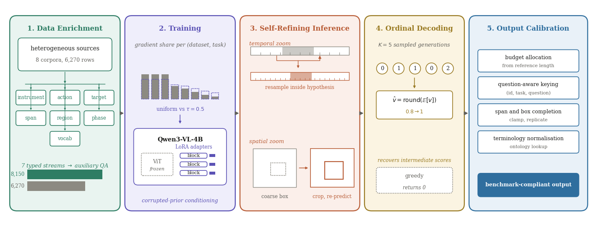

# Paper

**SPIRAL: Structured Supervision Harvesting and Self-Refining Inference for
Heterogeneous Medical Video Understanding**
Podakanti Satyajith Chary, Nagarajan Ganapathy
Indian Institute of Technology Hyderabad

ECCV 2026 Workshop on Medical Video Understanding (MedVidU). **Oral.**

- OpenReview: https://openreview.net/forum?id=Ude69Oicir
- Proceedings: Springer LNCS, to appear

The camera-ready PDF is not redistributed here. The OpenReview forum carries the
version made public by the workshop, and the Springer edition will appear in the
ECCV 2026 proceedings.

## Abstract

Operative video understanding demands instrument level precision, anatomical
specificity and multi phase temporal reasoning, while the released supervision
for these tasks remains scarce and heterogeneous. SPIRAL is a framework that
extracts additional signal from a fixed annotation budget and then spends
inference computation on self correction. Five components are combined.
Structured supervision harvesting decomposes each released annotation into seven
typed streams and synthesises auxiliary questions, expanding 6,270 rows to 8,150
without new labelling. Inverse frequency sampling equalises the gradient
contribution of sources differing by a factor of 9.3 in size. Prior conditioned
training exposes the model to deliberately corrupted timelines so that cross task
conditioning transfers to inference. Self refining grounding resamples inside a
coarse temporal hypothesis and re-predicts inside a coarse spatial crop. Ordinal
expectation decoding marginalises over sampled generations and recovers
intermediate rubric scores that greedy decoding discards. A leave one out study
establishes that the grounding operators substantially influence predictions
while their aggregate effect is direction free, which identifies evidence aware
candidate selection as the missing element of unguarded self refinement, and
expectation decoding reduces error on the ordinal skill rubric. Two supporting
analyses accompany the framework and are independent of it. Generation budget is
shown to bound attainable accuracy on sequence valued tasks by a factor of 7.35
while leaving per unit quality unchanged, and prediction indexing granularity is
shown to determine whether an answer reaches the question that produced it.

## Contributions

1. **Structured supervision harvesting.** Seven typed streams per annotation,
   fused per video across tasks, with synthesised auxiliary questions. The
   released split expands by 30 percent without new labelling.
2. **Two training stage corrections** for heterogeneity, comprising inverse
   frequency sampling over the source and task product and prior conditioned
   training that renders cross task conditioning transferable.
3. **Three inference stage operators**, comprising temporal resampling inside a
   coarse hypothesis, spatial re-prediction inside a coarse crop, and expectation
   decoding over sampled ordinal generations.
4. **An empirical characterisation of two properties** governing measured
   accuracy on this benchmark, namely generation budget on sequence valued tasks
   and prediction indexing granularity when several questions address one clip.

## Figures

| | |
|---|---|
|  | Framework overview |
|  | Output budget analysis |

Vector PDFs sit alongside the PNGs in `assets/`, and the generators are in
`assets/src/`.
